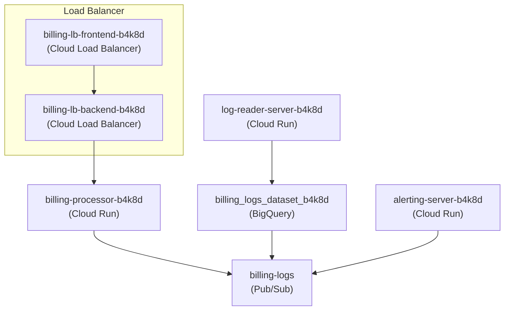

# Billing Processor (OOM Demo App)

This application is a sample designed to demonstrate a memory leak incident, specifically for testing an autonomous SRE self-healing agent.

## Components

-   **`billing_processor/app.py`**: A simple HTTP server (using Python's built-in `http.server`) that simulates a billing microservice.
-   **`billing_processor/utils/processor.py`**: Contains the processing logic and the unbounded cache that causes the memory leak.
-   **`trigger_incident.py`**: A script that sends rapid requests to the application to fill the cache and cause memory usage to spike.
-   **`sre_fleet/`**: Contains the configurations and script for the Autonomous SRE Self-Healer Fleet demo.
    -   `sandbox_profile.json`: Sandbox policy.
    -   `remediation_gate_policy.yaml`: Gateway policy.
    -   `model_armor_config.json`: Model Armor config.
    -   `execution_incident_healer.py`: Orchestration script.

## Architecture

The application is deployed on Google Cloud Platform using the following components:
- **Cloud Run**: Hosts the core services.
    - `billing-processor`: Processes transactions and publishes logs.
    - `alerting-server`: Receives logs via Pub/Sub push and triggers alerts.
    - `log-reader-server`: Reads logs from BigQuery.
- **Cloud Pub/Sub**: Channels logs from the billing processor to other services.
- **BigQuery**: Stores logs for long-term analysis.
- **Regional Load Balancer**: Manages traffic to the billing processor.

### Diagram



## How It Works

The application exposes a `/process` endpoint. Each request to this endpoint with a `tx_id` adds a simulated large payload (1MB) to an in-memory dictionary in `processor.py`. This dictionary is never cleared, simulating a classic memory leak.

## Usage

### 1. Start the Application
Run the server from the root directory:
```bash
python3 billing_processor/app.py
```
The server will listen on port `8080`.

### 2. Check Status
You can check the current cache size by hitting the `/status` endpoint:
```bash
curl http://localhost:8080/status
```

### 3. Trigger the Incident
To simulate sustained load and trigger the memory leak:
```bash
python3 trigger_incident.py
```
This script will send thousands of requests, rapidly increasing memory usage.
